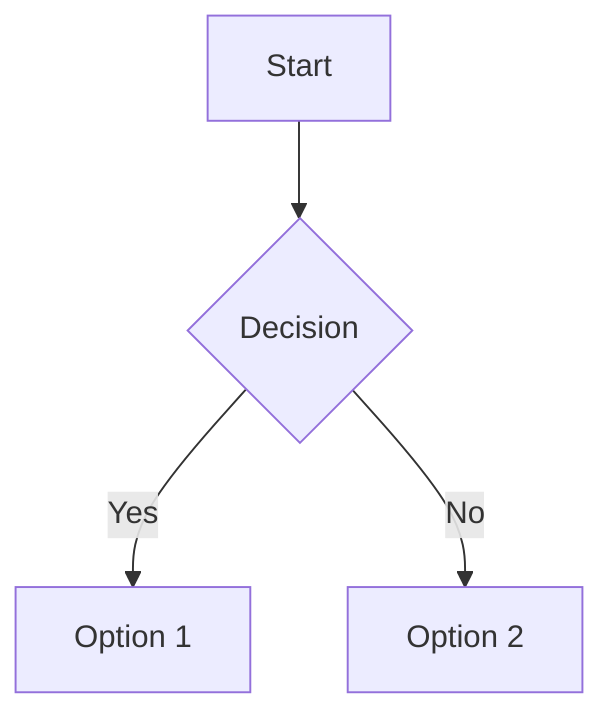

# Headings

# Heading 1
## Heading 2
### Heading 3
#### Heading 4
##### Heading 5
###### Heading 6

---

# Paragraphs & Line Breaks

This is a paragraph.

This is another paragraph.

This line ends with two spaces.  
This line follows the line break.

---

# Text Styling

- **Bold**: `**Bold**`
- *Italic*: `*Italic*`
- ***Bold & Italic***: `***Bold & Italic***`
- ~~Strikethrough~~: `~~Strikethrough~~`
- ==Highlight==: `==Highlight==`

---

# Lists

## Unordered List

- Item 1
  - Subitem 1.1
    - Subitem 1.1.1

## Ordered List

1. First
2. Second
   3. Sub-second
   4. Sub-third

## Task List

- [x] Completed Task
- [ ] Incomplete Task
- [-] Canceled Task

# Links

- [External Link](https://obsidian.md)
- Internal Link: `[[Another Note]]`
- Aliased Link: `[[Another Note|Custom Text]]`

# Images

![[gruvbox_colors.png|Gruvbox Pallete]]


# Blockquotes

> This is a blockquote.
> 
> > Nested blockquote.

# Callouts

> [!note] Note Title
> This is a note callout.

> [!tip] Tip Title
> This is a tip callout.

> [!warning] Warning Title
> This is a warning callout.

> [!danger] Danger Title
> This is a danger callout.

# Code

## Inline Code

Use `code` to denote inline code.

## Code Block

```python
def hello_world():
    print("Hello, world!")
```

# Tables

|Syntax|Description|
|---|---|
|Header|Title|
|Paragraph|Text|

# Footnotes

This is a statement with a footnote.[^1]

# Math

Inline math: $E = mc^2$

Block math:

# Mermaid Diagram




# Horizontal Rule

---

# Escaping Characters

To display a literal asterisk (\*), use a backslash: `\*`

```markdown
\*This text is not italicized\*
```

# HTML Elements

You can use HTML for advanced formatting:

<span style="color: red;">Red Text</span>

# Emoji

You can include emojis by copying and pasting them: 😄 🎉 🚀

# Task List with Custom Symbols

- [x] ✔️ Completed
    
- [ ] ❌ Not Completed
    
- [~] 🔄 In Progress
    
# Internal Embeds

![[Another Note]]

# Tags

#tag1 #tag2 #tag_with_underscores

# YAML Front Matter

```yaml
---
title: "Obsidian Typography Reference"
author: "Your Name"
date: 2025-05-22
tags: [reference, markdown, obsidian]
---
```
