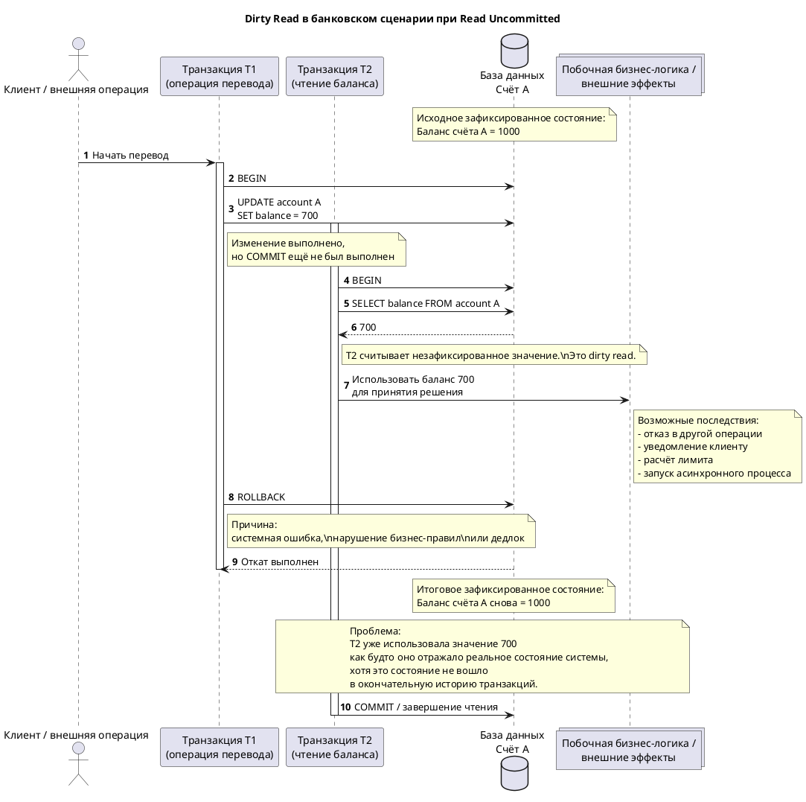

# 1. Read Uncommitted (Чтение незафиксированных данных)

> Read Uncommitted (Чтение незафиксированных данных) — это классический уровень изоляции транзакций, при котором операция чтения имеет право наблюдать изменения, выполненные параллельными транзакциями, даже если эти изменения ещё не были окончательно зафиксированы оператором `COMMIT`.

* В иерархии классических уровней изоляции (согласно стандарту ANSI SQL-92) `Read Uncommitted` представляет нижнюю границу по строгости видимости данных: он не требует, чтобы читающая транзакция работала исключительно с подтверждённым состоянием базы данных. 
* Данный уровень является самым слабым в традиционной шкале [[Transaction Isolation Levels]]. С практической и академической точек зрения `Read Uncommitted` важен прежде всего как теоретический и сравнительный ориентир. Он эксплицитно демонстрирует поведение системы, которая почти не ограничивает конкурентное чтение и допускает наблюдение промежуточных, потенциально откатываемых состояний.

| Уровень изоляции | Грязное чтение (Dirty Read)                          | Неповторяющееся чтение (Non-repeatable Read) | Фантомное чтение (Phantom Read) | Использование                        |
| --------------------------------------------- | --------------------------------------------------------------------------------- | ------------------------------------------------------------------------- | ------------------------------------------------------------ | ----------------------------------------------------------------- |
| **Read Uncommitted**                          | Possible (Solved in PG) | Possible                                     | Possible                        | Используется редко, когда скорость важнее согласованности данных. |
# 2. Этимология и происхождение термина

Термин `Read Uncommitted` буквально переводится как «чтение незафиксированных данных». Его семантика напрямую отражает ключевую архитектурную особенность данного режима: прямое отсутствие требования читать только то состояние, которое уже успешно прошло границу фиксации.

Компонент «uncommitted» указывает на данные, физические или логические изменения по которым уже выполнены в буферах памяти или на дисках внутри контекста другой транзакции, но ещё не подтверждены системой как окончательные. Следствием этого статуса является то, что такие изменения находятся в транзитном состоянии и могут быть позднее полностью отменены посредством оператора `ROLLBACK`.

# 3. Историческое развитие и эволюция концепта

В инженерной традиции `Read Uncommitted` прочно закрепился как неотъемлемая часть классической шкалы уровней изоляции, изначально сформулированной в стандартах SQL и фундаментальной учебной литературе по транзакционным системам. Его историческая роль состояла не столько в том, чтобы служить рекомендованным или безопасным режимом эксплуатации в production-средах, сколько в том, чтобы задать математически минимальную точку отсчёта для сравнения с более строгими протоколами управления конкурентным доступом.

Исторически концепт возник в контексте поиска компромисса между двумя антагонистическими требованиями проектирования баз данных: обеспечением максимальной конкурентности доступа (throughput) и контролем аномалий изоляции (consistency). `Read Uncommitted` отражает предельно слабую позицию в этом компромиссе: система практически не защищает читателя от наблюдения промежуточных состояний, минимизируя накладные расходы на управление блокировками чтения.

В дальнейшем эволюция архитектур реляционных СУБД, в особенности повсеместное внедрение систем управления многоверсионностью (MVCC), привела к тому, что актуальность данного уровня существенно снизилась. Во многих современных реализациях он либо отсутствует как физически отдельный механизм маршрутизации доступа, либо синтаксически поддерживается парсером для сохранения обратной совместимости, но фактически ведет себя как более строгий уровень, чаще всего деградируя до `[[Read Committed]]`.

### 4. Формальные свойства, структура и ключевые признаки

**Основной признак**

Ключевое логическое свойство `Read Uncommitted` заключается в следующем: операция чтения не обязана ограничиваться только зафиксированными версиями данных. Если транзакция $T_1$ изменила кортеж, но ещё не выполнила `COMMIT`, транзакция $T_2$ при работе на уровне `Read Uncommitted` может беспрепятственно прочитать это промежуточное значение.

**Гарантии изоляции**

На уровне видимости операций чтения этот режим предоставляет минимальный набор структурных гарантий:

- Гарантия транзакционной структуры: транзакция всё ещё существует как формальная единица выполнения с собственными границами `BEGIN`, `COMMIT` и `ROLLBACK`.
    
- Гарантия атомарности записи: система по-прежнему обеспечивает атомарность фиксации для самой изменяющей транзакции (эксклюзивные блокировки на запись не отменяются).
    
- Отсутствие гарантии подтвержденного состояния: не гарантируется, что читаемые данные принадлежат зафиксированной истории.
    
- Отсутствие гарантии повторяемости: не гарантируется стабильность результатов чтения внутри одной транзакции при повторном обращении к ресурсу.
    
- Отсутствие гарантии стабильности предикатов: не гарантируется постоянство множества строк, удовлетворяющих критериям поиска при повторном запросе.
    

**Допускаемые транзакционные аномалии**

- Dirty Read (Грязное чтение): безусловно допускается. Это определяющий архитектурный признак данного уровня.
    
- Non-repeatable Read (Неповторяющееся чтение): допускается. Повторное чтение идентичной строки может дать другой результат, поскольку параллельная транзакция может зафиксировать новое значение между двумя операциями чтения.
    
- Phantom Read (Фантомное чтение): допускается. Повторное выполнение предикатного запроса может вернуть иной набор кортежей.
    

**Логическая природа уровня**

`Read Uncommitted` следует понимать не как «режим хаотического доступа без транзакций», а исключительно как транзакционный режим с предельно слабым требованием к видимости чтения. Это критически важное уточнение: уровень ослабляет именно изоляцию чтения, но не отменяет саму транзакционную модель, механизмы журналирования (WAL) или контроль над целостностью записи.

### 5. Сравнение с соседними понятиями: Read Committed

Различие между `Read Uncommitted` и `[[Read Committed]]` проходит по фундаментальной границе допустимости состояний: обладает ли транзакция правом читать данные, которые ещё не зафиксированы другой транзакцией.

- `Read Uncommitted`: транзитное, незафиксированное чтение допускается механизмом СУБД.
    
- `Read Committed`: такое чтение строго запрещено; каждая операция чтения должна видеть исключительно зафиксированное состояние системы.
    

Из этого архитектурного различия следует прямой практический эффект. При использовании `Read Uncommitted` прикладное программное обеспечение может принять решение на основе значения, которое позже безвозвратно исчезнет после отката. При `Read Committed` приложение всё ещё сохраняет уязвимость к неповторяющемуся чтению или фантомам, но оно гарантированно не строит свою бизнес-логику на заведомо незавершённом, нестабильном результате чужой транзакции. Переход от `Read Uncommitted` к `Read Committed` устраняет не все классы аномалий конкурентного доступа, но купирует наиболее деструктивную из них: чтение данных, которые физически не вошли в согласованное зафиксированное состояние системы.

### 6. Математическое и логико-формальное ядро

Формально уровень `Read Uncommitted` описывается через ослабленное отношение видимости (visibility relation) между транзакциями в теории расписаний (schedule theory).

Пусть транзакция $T_1$ выполняет операцию записи $W_1(x = v)$ над элементом данных $x$ и ещё не достигла терминального состояния (ни `COMMIT`, ни `ROLLBACK`). Пусть параллельная транзакция $T_2$ выполняет операцию чтения $R_2(x)$. Для уровня изоляции `Read Uncommitted` признается допустимой следующая история (history) выполнения:

$W_1(x = v) \rightarrow R_2(x = v) \rightarrow ROLLBACK_1$

Данная формальная запись означает, что транзакция $T_2$ наблюдала значение $v$, которое было отменено операцией $ROLLBACK_1$ и никогда не стало частью окончательного состояния базы данных. В терминах теории аномалий это репрезентирует формальный шаблон dirty read: чтение результата незавершённой и потенциально откатываемой записи.

Логическое следствие: наблюдаемое состояние в транзакции $T_2$ не обязано принадлежать множеству консистентных состояний, достижимых через строгую сериализацию или последовательность исключительно зафиксированных транзакций. Иначе говоря, транзакция имеет возможность оперировать состоянием, не имеющим статуса устойчивой версии базы данных.

# 7. Пример dirty read и его последствий

Рассмотрим классический финансовый (банковский) сценарий, демонстрирующий механику и риски грязного чтения.

- **Исходное состояние:** на счёте субъекта A хранится консистентный баланс 1000 условных единиц.
- **Действие 1:** Транзакция $T_1$ начинает операцию перевода и временно уменьшает баланс счёта A до 700. Операция `COMMIT` ещё не инициирована.
- **Действие 2:** Транзакция $T_2$ в этот же квант времени выполняет чтение баланса счёта A и получает незафиксированное значение 700.
- **Действие 3:** Транзакция $T_1$ сталкивается с системной ошибкой, нарушением бизнес-правил или дедлоком и выполняет операцию `ROLLBACK`.
- **Итоговое зафиксированное состояние:** баланс счёта A откатывается и снова равен 1000 единицам.

**Последствия для системы:**

Проблема заключается в том, что транзакция $T_2$ уже экстрагировала и использовала значение 700, трактуя его как будто оно отражало реальное, объективное состояние системы. Если на основе этого чтения были выполнены любые побочные действия — отказ в авторизации другой операции, генерация клиентского уведомления, расчёт кредитного лимита или запуск компенсирующего асинхронного процесса, — то логика приложения оказывается необратимо построенной на состоянии, которого в согласованной истории базы данных никогда не существовало. Главный риск dirty read: транзакция считывает не просто «устаревшие» данные, а данные фиктивные с точки зрения окончательной истории транзакций.

### 8. Практические применения

В условиях промышленной эксплуатации (production) `Read Uncommitted` используется исключительно редко. Главная причина кроется в том, что потенциальный выигрыш в конкурентности и снижение lock-contention обычно не способны компенсировать катастрофический риск чтения откатываемых данных. Для абсолютного большинства прикладных доменов (финансовых, учётных, складских, заказных и аналитически чувствительных систем) возможность построить бизнес-логику на незафиксированном состоянии признается инженерно неприемлемой.

Ограниченные сценарии легитимного применения локализованы в нишах, где допускается заведомо приближённое, эвристическое или сугубо диагностическое чтение, а последствия статистической ошибки несущественны. К таким случаям можно отнести:

- Оценку прогресса выполнения массивных DML-операций.
    
- Сбор грубых телеметрических метрик.
    
- Выполнение запросов для оценки кардинальности (cardinality estimation) в рамках оптимизации.
    

Однако даже в этих узких ситуациях архитекторы чаще предпочитают иные механизмы (асинхронные реплики, специализированные витрины данных), поскольку `Read Uncommitted` создает критически слабую семантическую опору для надежной интерпретации результата.

В современных СУБД практическая роль этого уровня часто дополнительно маргинализована: системы, основанные на архитектуре многоверсионности (MVCC), фундаментально не реализуют «настоящее» грязное чтение из-за изоляции снимков. В таких продуктах `Read Uncommitted` выступает лишь как формально поддерживаемое имя стандарта, а не как реально обособленная модель физической видимости.

### 9. Современное значение и интерпретации

В современной инженерной и академической практике `Read Uncommitted` интерпретируется не как предпочтительный рабочий режим, а прежде всего как нижний теоретический предел транзакционной изоляции. Его концептуальное значение сегодня базируется на трёх аспектах:

- **Аспект сравнительный:** он предоставляет базис для понимания того, какую именно минимальную защиту и какие накладные расходы добавляет `[[Read Committed]]`.
    
- **Аспект дидактический:** он служит безупречной наглядной моделью для объяснения природы dirty read и прямой взаимосвязи между видимостью данных и корректностью прикладной логики программного обеспечения.
    
- **Аспект реализационный:** он наглядно демонстрирует феномен расхождения спецификаций: имя уровня изоляции в стандарте и фактическое поведение конкретного движка СУБД не всегда совпадают буквально. В современных системах разработчикам критически важно различать академическую терминологию SQL и реальный механизм многоверсионной или блокировочной реализации.
    

### 10. Типичные ошибки, заблуждения, ограничения

**Типичные заблуждения:**

- **Заблуждение о градации:** Восприятие `Read Uncommitted` как просто «немного менее строгого» варианта `Read Committed`. Уточнение: различие носит бинарный, принципиальный характер, потому что `Read Uncommitted` снимает запрет на чтение незавершённых изменений, позволяя видеть данные, подверженные полному уничтожению.
    
- **Заблуждение об онтологии данных:** Уверенность в том, что если данные были успешно прочитаны СУБД, значит, они гарантированно существовали в реальном согласованном состоянии базы. Уточнение: на данном уровне прочитанное значение могло существовать исключительно как временный эффект в оперативной памяти незавершённой транзакции.
    
- **Заблуждение о производительности:** Попытки использовать уровень везде, где требуется высокая производительность и масштабируемость. Уточнение: линейный рост конкурентности не имеет самостоятельной ценности, если ценой этого роста выступает потеря интерпретируемости результата. Грязное чтение разрушает базовый смысл транзакционного чтения как надежного основания для принятия программных решений.
    

**Системные ограничения:**

- `Read Uncommitted` практически не даёт содержательных формальных гарантий на уровне чтения, что делает его фундаментально непригодным для интеграции в бизнес-логику, чувствительную к корректности наблюдаемого состояния.
    
- В значительном ряде современных СУБД этот уровень либо не поддерживается как физически отдельный режим, либо принудительно эмулируется более строгим поведением (промоутируется до `Read Committed`). Следовательно, заявленное имя уровня в технической документации и фактическая семантика операций чтения обязаны анализироваться инженером раздельно.
    

### 11. Связанные понятия

Родительская тема:

- `[[Transaction Isolation Levels]]`: общий теоретический и практический контекст шкалы уровней изоляции, внутри которой `Read Uncommitted` концептуально и исторически выступает как самый слабый классический уровень.
    

Связанные заметки:

- `[[Isolation Anomalies]]`: строгий набор аномалий конкурентного доступа, служащих метриками для верификации строгости уровня изоляции; для `Read Uncommitted` единственной специфичной и наиболее деструктивной является аномалия dirty read.
    
- `[[Read Committed]]`: ближайший более строгий стандартный уровень в иерархии SQL, директивно запрещающий чтение незафиксированных данных, однако сохраняющий уязвимость к остальным нелинейным аномалиям конкурентного доступа.
# Read Uncommitted

## Краткое определение

Каноническая статья для самого слабого классического уровня изоляции.

## Основная идея или механизм

Нужно раскрыть, какие чтения он допускает, какие аномалии не предотвращает и почему на практике используется редко или ограниченно.

## Границы темы

- Какие гарантии дает этот уровень.
- Чем он отличается от `Read Committed`.

## Связи с другими заметками

Родительская тема:

`[[Transaction Isolation Levels]]`

Связанные заметки:

- `[[Isolation Anomalies]]`
- `[[Read Committed]]`

## Примеры, случаи или следствия

Добавить пример dirty read и его последствий.

## Что стоит раскрыть дальше

- [ ] Уточнить определение
- [ ] Добавить связи
- [ ] Проверить `aliases`
- [ ] Проверить `tags`
